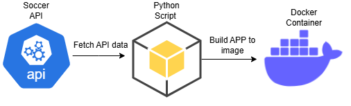

<p align="center">
  
  
## ☁️ 30 Days DevOps Challenge - Building a Containerized Soccer Stats App  ☁️

This is part of the sixth project of the 30-days DevOps Challenge! 

In this project we will be fetching Soccer sports API data from a Python application which will be wrapped up nicely as a Docker container! This part of the challenge outlines the learning process of working with microservices and containers.


<h2>Environments and Technologies Used</h2>

  - Docker
  - Amazon Web Services
  - Github Codespaces
  - Python
  - RapidAPI
  
  
<h2>Key Features</h2>  

✅API Integration: Can fetch real-time or historical soccer data from a sports API (e.g., Football-Data.org, API-Football, or Sportradar).
✅Microservices Architecture: Modularizes the application into smaller services (e.g., data fetching, data processing, storage).
✅Docker Containerization: Creating a Dockerfile to containerize applications, and easily test and deploy them without issue!


<h2>Step by Step Instructions</h2>

***1. Repo configuration***


NOTE: Keep in mind this is for a Linux environment, check the AWS documentation to install it in your supported OS.


   curl "https://awscli.amazonaws.com/awscli-exe-linux-x86_64.zip" -o "awscliv2.zip"
unzip awscliv2.zip
sudo ./aws/install


We then do `AWS configure` and enter our access and secret key along with the region. Output format set to JSON. With this command we will double check that our credentials are put in place for CLI:

```
aws sts get-caller-identity
```

We will then roceed with installing the Docker CLI and Docker in Docker (Github Codespaces Setup)

```
curl -fsSL https://download.docker.com/linux/static/stable/x86_64/docker-20.10.9.tgz -o docker.tgz \
tar -xzf docker.tgz \
sudo mv docker/docker /usr/local/bin/ \
rm -rf docker docker.tgz
```

`Ctrl + p` on Github Codespace > `Add Dev Container Conf files` > modify your active configuration > click on Docker (Docker-in-Docker)


***2.  API and Requirements Setup***

In this step we will preparing our files for container deployment.

We will start by creating an .env file with our API keys (make sure a .gitignore is added to avoid exposing keys. )

```
nano .env 

RAPID_API_KEY=your_api_key_here
```

Then, we will be creating the requirements needed for deploying our application (Libraries and dependencies):

```
nano requirements.txt

fastapi==0.68.1
uvicorn==0.15.0
requests==2.26.0
python-dotenv==0.19.0
pytest==6.2.5
httpx==0.19.0
python-multipart==0.0.5
```

Within our Python app, there are variables to be applied that we will grab the data from 

```
/ - Welcome message and available endpoints
/health - Health check endpoint
/player/{player_id} - Get player statistics
/topscorers/{league_id} - Get top scorers for a league (default: Premier League)
```

With this app we will fetch player stats from the Premier League, for instance, the top players with most goal scores.

***3. Docker Test and Debugging***

In this step, we will be building and testing our image as well as describing debugging tips for potential issues.

We start by building the docker image within our repo:

```
docker build -t soccer-stats .
```

Then, we will test the container:

```
docker run -p 8000:8000 --env-file .env soccer-stats
```


***Cleanup***

When you're done, you can clean up the Docker resources with these commands:

```
# Stop the container
docker stop $(docker ps -q --filter ancestor=soccer-stats)

# Remove the container
docker rm $(docker ps -aq --filter ancestor=soccer-stats)

# Remove the image
docker rmi soccer-stats

# Remove all unused containers, networks, images (use with caution)
docker system prune
```

<h2>Conclusion</h2>

In this project, I learned how to leverage a python application with API data and how to build it to a docker container to further cement DevOps principles.
